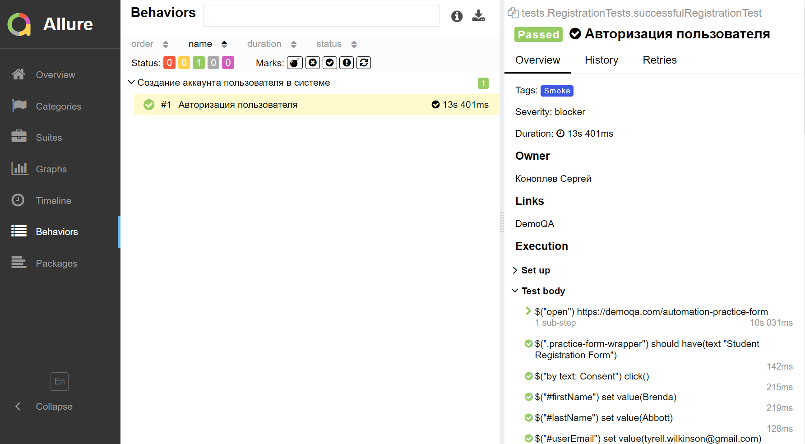
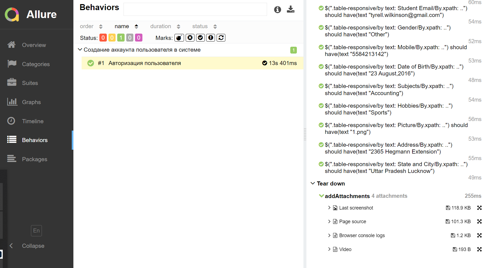
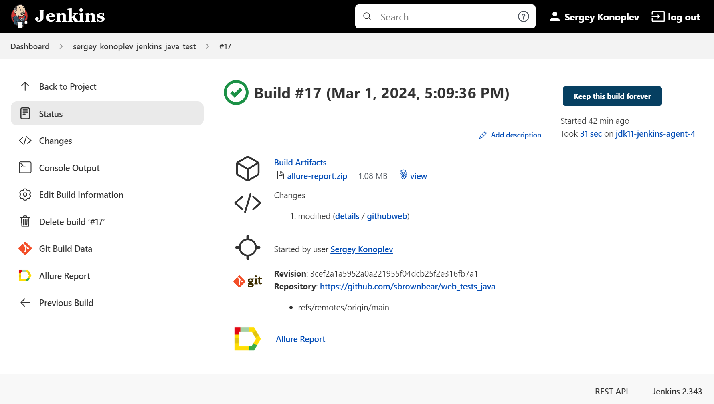
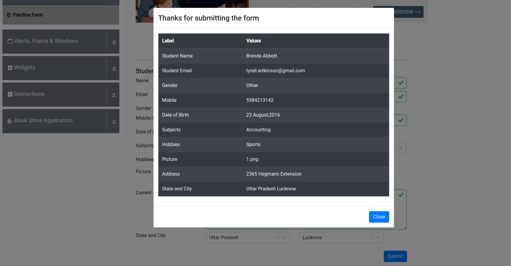
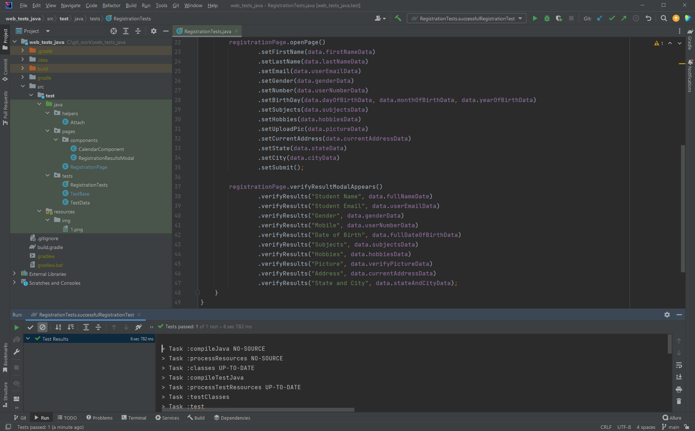

## Тест на форму регистрации на сайте [demoqa.com](https://demoqa.com/automation-practice-form)

### Инструменты:
- Java + Selenide
- JUnit5 + Gradle
- PageObject
- Allure-отчет + аннотации
- AddListener для просмотра сценария тестов
- Аttachments для Allure (скриншот, видео, page source, console logs)
- CI/CD Jenkins + Selenoid
- Генерация тестовых данных JavaFaker

### Allure-отчет и addListener

### Allure-отчет и Attachments

### Сборка в Jenkins

### Скриншот в конце теста

### Успешный тест и структура проекта

